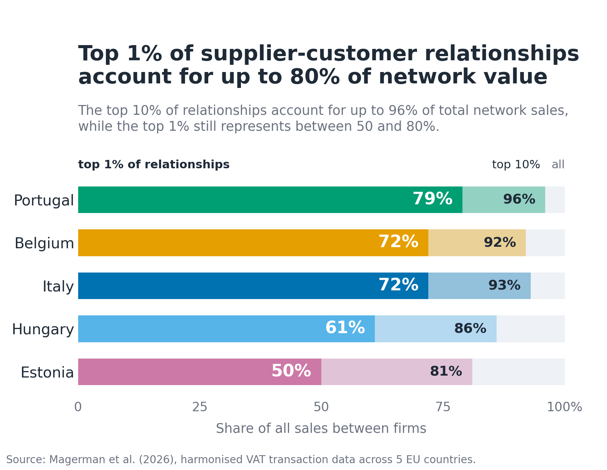

# Firm-to-firm production networks across five EU countries

Harmonised firm-to-firm production networks for Belgium, Estonia, Hungary, Italy and Portugal, built from administrative VAT and e-invoicing records within the ECB's [Challenges for Monetary Policy Transmission in a Changing World (ChaMP)](https://www.ecb.europa.eu/pub/economic-research/research-networks/html/champ.en.html) research network.

Coordinated by [Glenn Magerman](mailto:glenn.magerman@ulb.be) (ECARES, ULB), [Alberto Palazzolo](mailto:alberto.palazzolo@nbb.be) (NBB) and [Emmanuel Dhyne](mailto:emmanuel.dhyne@nbb.be) (NBB).

This repository holds three things:

1. **The pipeline.** One Python code base that every partner runs on its own confidential micro data, on its own premises. Only aggregate statistics leave the building. The same code produces the same statistics in every country, which is what makes the results comparable.
2. **The key moments.** A compact table of harmonised network statistics for the five countries, taken from the paper's tables, for use as calibration targets in quantitative models of production networks. See [`moments/`](moments/).
3. **A way in for other countries.** If you have firm-to-firm transaction data, you can run the pipeline on it and compare your economy to the five. See [Run it on your data](#run-it-on-your-data).

## The paper

Magerman, G., A. Palazzolo, E. Dhyne, A. Borsos, D. Kulikov, A. Linarello, A. Paulus, G. Romanini and M. Saldias (2026), "Beyond firm size: network position and shock transmission in firm-to-firm production networks across five economies". Working paper, September 2026.

The paper covers around 3 million firms and more than 100 million supplier-customer relationships in 2019. Five facts stand out:

- Production networks are extremely concentrated. The top 10% of firms account for 80 to 90% of network sales, and the top 1% of supplier-customer relationships for 50 to 80% of the value traded.
- Firm-to-firm networks are not a finer version of sector input-output tables. Sector tables are nearly complete (80 to 95% of possible sector pairs trade), while firm networks have densities in the order of 1 in 10,000, and within a single supplier-customer sector pair firm level input shares spread two to four times their sector average.
- Firm size is a network outcome: within narrow industries, about half of the variance in firm size relates to the number of customers a firm serves.
- A firm's position along the production chain (upstreamness, downstreamness) is orthogonal to its size and centrality, and cannot be recovered from sector tables.
- Production networks create an indirect channel of monetary policy transmission. A tightening affects firms directly, but also propagates backward through their customers: further upstream, this indirect demand channel dominates the response. Differences in production structure therefore generate different aggregate responses to the same ECB shock.

## Key moments

The table below is an extract of [`moments/key_moments.csv`](moments/key_moments.csv), which holds 43 harmonised statistics per country with the paper table each comes from. All statistics are aggregate, satisfy each institution's confidentiality protocol (at least 5 observations per reported cell), and are directly comparable across countries. Base year 2019.

| Moment | BE | EE | HU | IT | PT | Source |
|---|---:|---:|---:|---:|---:|---|
| Firms | 544,104 | 103,592 | 315,259 | 1,668,485 | 459,548 | Table 1 |
| Relationships | 13.1m | 0.84m | 2.1m | 59.4m | 38.7m | Table 1 |
| Density, firm level | 4.4e-5 | 7.8e-5 | 2.1e-5 | 2.1e-5 | 1.8e-4 | Table 6 |
| Density, NACE 2-digit | 0.95 | 0.80 | 0.78 | 0.91 | 0.93 | Table 6 |
| Top 10% of firms, share of network sales | 0.89 | 0.81 | 0.86 | 0.87 | 0.87 | Table 2 |
| Top 1% of relationships, share of network sales | 0.72 | 0.50 | 0.61 | 0.72 | 0.79 | Table 2 |
| Customers per firm, p50 / p99 | 2 / 343 | 1 / 110 | 2 / 85 | 1 / 459 | 6 / 1,074 | Table B.2 |
| Tail exponent, number of customers | 1.39 | 1.47 | 1.62 | 1.46 | 1.37 | Table B.1 |
| Corr(ln sales, ln upstreamness), within NACE 2 | 0.01 | -0.10 | -0.04 | 0.06 | -0.03 | Table 3 |
| Size variance share of number of customers | 0.46 | 0.45 | 0.42 | 0.51 | 0.49 | Table 4 |
| Median CV of input shares within NACE 2 sector pairs | 3.0 | 1.9 | 2.0 | 3.6 | 3.6 | Table 7 |

`figures/make_figures.py` renders the figures in this README from the CSV, so they stay in sync with the table.

## How to cite

If you use the code or the moments, please cite the paper (reference above). A [`CITATION.cff`](CITATION.cff) file is included, so GitHub's "Cite this repository" button gives you BibTeX and APA.

## Run it on your data

The pipeline runs on any dataset with two tables. Nothing needs to leave your premises: the code runs locally and writes aggregate statistics to `tasks/task3_network_statistics/output/`.

**Input tables** (CSV or Stata `.dta`, placed in `tasks/raw_data/`):

| Table | Variables | One row per |
|---|---|---|
| Firm-to-firm transactions | `year`, `vat_i` (seller), `vat_j` (buyer), `sales_ij` | seller, buyer, year |
| Firm level data | `year`, `vat`, `nace`, `turnover`, `inputs_total` | firm, year |

**Steps**

1. Clone the repository and create a virtual environment with Python 3.12: `pip install -r tasks/requirements.txt`.
2. Edit `tasks/config/config.yaml`: set `country`, the years, `data_type: "real"`, and the file names and extensions of your two tables.
3. Run `python tasks/_master_call.py`. Each task erases its previous output and rebuilds it, so a run is always consistent with the current code.
4. To test the code without data, set `data_type: "random"`. Task 0 then generates a synthetic network with the right variable names.

The output statistics are the ones in `moments/key_moments.csv`, so your country can be placed next to the five in the paper directly.

## Pipeline structure

The code is organised as modular tasks. Each task has an input, a function and an output, and the output of one task is the input of the next. Every task has a master file that initialises the task (erases previous results), runs the scripts and creates the output. `tasks/_master_call.py` runs all tasks in order.

| Task | What it does | Main modules |
|---|---|---|
| `task0_random_data` | Generates synthetic B2B and firm data with the project's variable names, for testing | `create_random_B2B.py`, `random_firm_data.py`, `quarterly_firm_data.py` |
| `task1_sum_stats` | Summary statistics of the raw input tables | `sum_stat.py` |
| `task2_clean_data` | Cleans both tables (for example bilateral sales above total turnover), merges them and builds the panel | `clean_B2B_df.py`, `clean_firm_df.py`, `merge_and_clean_data.py`, `create_panel.py` |
| `task3_network_statistics` | Network statistics per year: degree distributions and CCDFs with tail exponents, concentration, within industry correlations, coefficients of variation of input and output shares within sector pairs, the firm size variance decomposition, and the monetary policy counterfactual | `ccdf.py`, `distributions.py`, `ext_mgn_correlations.py`, `coefficients_of_variation.py`, `var_decomposition.py`, `monpol.py` |

`tasks/common/` holds the configuration loader and shared utilities. `tasks/raw_data/` holds, next to your input tables, the Belgian impulse response estimates and World Bank GDP data used by the monetary policy counterfactual (see [`tasks/raw_data/README.md`](tasks/raw_data/README.md)).

## Join the network

Every additional country makes the benchmark more useful. If your institution holds firm-to-firm transaction data (VAT listings, e-invoicing, payment data) and firm level accounts, the sequence is: a zero commitment pilot on the synthetic data (task 0), a call with the coordinating team, then a full run on your data. What you get: a cross country benchmark for your economy and the possibility to participate in extensions of the project and follow-up research. Contact Glenn Magerman.

## Data protection and governance

The project is a distributed micro data project. Each partner runs the code on its own premises under its own data protection rules, and reports only aggregate results with at least 5 observations per cell. No individual data, and no data points from which individual firms or transactions could be recovered, are reported. The full governance, workflow and reporting rules are in [`docs/GOVERNANCE.md`](docs/GOVERNANCE.md).

## Authors and institutions

Paper authors: Glenn Magerman (ECARES, ULB, CEPR, CESifo), Alberto Palazzolo (ECARES, ULB and National Bank of Belgium), Emmanuel Dhyne (National Bank of Belgium), András Borsos (Magyar Nemzeti Bank), Dmitry Kulikov (Eesti Pank), Andrea Linarello (Banca d'Italia), Alari Paulus (Eesti Pank), Giacomo Romanini (Banca d'Italia), Martín Saldías (Banco de Portugal).

The code was written by Alberto Palazzolo. The project started within the ECB's ChaMP research network.

## License

Code is released under the MIT License, see [`LICENSE`](LICENSE). The reported statistics in `moments/` and the figures reproduce aggregate results from the paper and remain subject to the relevant institutional publication and data governance rules. Please cite the paper when using them.
